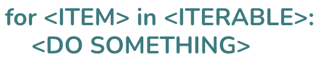

# Catch-up Week, Day 1: `for` Loops and Objects

## `for` Loops
### Introduction
---
You might say that the whole point of programming is to do a lot with a little.  A program that just printed the integers from 0 to 5 wouldn't be all that useful.  After all, we can just write out "0 1 2 3 4 5" by hand faster than it would take to write a program to have the computer do it for us.  What's the point?

However, computers really start to shine when you give them a whole bunch of simple tasks.  Instead of just counting up to 5, what if we wanted to count up to a million?  In that case, the difference between a computer's performance and a human's becomes blindingly obvious.

But, we don't get that kind of efficiency for free in code.  It's possible to write bad code that's just as tedious as writing out all the integers from 0 to a million.  Take a look at this:

```python
print(0)
print(1)
print(2)
print(3)
print(4)
print(5)
```

If we wanted to print out all the numbers up to a million, using that code, we might as well just write out the numbers by hand.  The above program represents a one-to-one correspondence between what we want, and what the computer should do.

Imagine if you hired an accountant to do your taxes, and instead of just saying, "Here are all my receipts, please do my taxes," you had to tell him:
1. Take the first receipt.
2. Add that number to the total.
3. Take the second receipt.
4. Add that number to the total.<br/>
...

You might as well just do it yourself.

Fortunately, the very smart people who make programming languages have given us a number of tools to help out with repetitive tasks.  One of them is loops.

Loops are an abstraction that allow us to succintly express some kind of repetition (or iteration).

In Python, we can print all the integers from zero to a million, in just two lines:

```python
for i in range(100001):
  print(i)
```

And making that a billion takes just a couple more keystrokes.  That is the power of the `for` loop.

### The Structure of the `for` Loop
---
In Python, the basic structure of a `for` loop looks like this:<br/>


`ITEM` is just a variable representing any given item in the `ITERABLE`.  An iterable is just a collection that can be looped over (lists, dictionaries, range, enumerate).  What exactly makes something "iterable" is beyond what we're doing right now, but as long as you know what kind of things are iterable, you'll be good.

Lastly, `DO SOMETHING` is a stand-in for any number of statements and/or expressions.

### Customizing Your Loop
---
Once you understand that basic purpose of a `for` loop, a question still remains: What do I loop over?  In Python, there are a number of variations of `for` loops, and learning how to choose the best one for the task is an important skill.

Here are some basic cases:
```python
lst
range(num)
range(len(lst))
enumerate(lst)
```
#### `lst`
If you want to directly access every value in an iterable, then you can do that simply in Python.

##### Example:
```python
# print a greeting from each name in a list
lst = ["Bob", "Sally", "Frank"]
for name in lst:
  print(f"{name} says hi")
```

#### `range(num)`
If you know how many times you want to do something, then iterating over a `range` is the right tool.

##### Example:
```python
# print all integers from 0 to 10
for i in range(11):
  print(i)
```

#### `range(len(lst))`
If you want the index of each element in a list, then you can pass the length of the list to `range`.

##### Example:
```python
# Add a last name to everyone in a list of names
lst = ["Bob", "Sally", "Frank"]
for i in range(len(lst)):
  lst[i] = lst[i] + " Smith"
```

#### `enumerate(len(lst))`
`enumerate` is a little different because it returns a tuple instead of a single value.  The tuple has the form `(index, value)`.  You can use this for cases where you want to access both the index and value.

##### Example:
```python
# Add a last name to everyone in a list of names, but first check for the correct name
lst = ["Bob", "Sally", "Frank"]
for i, name in enumerate(lst):
  if name == "Frank":
    lst[i] = lst[i] + " Jones"
  else:
    lst[i] = lst[i] + " Smith"
```


## Objects
---
In the examples above we were mostly using lists.  If you want to directly access a particular value in a list, you need to know it's index.  So in `lst = ["Bob", "Sally", "Frank"]`, Bob's index would be 0.  That is perfectly fine for many use-cases.  However, there are times when we want a more meaningful label for some particular piece of data in a collection.

Let's say that, instead of just a list of names, we want to have a more detailed representation of each person.  Bob might look like this:

```python
bob = {
  "name": "Bob",
  "age": 15,
  "hobbies": ["skiing", "falling", "getting up"]
}
```
Now, if we want to know something about Bob, we can use a meaningful name (key) to grab it.  Bob's name will be `bob["name"]`.  Makes sense.

Compare this to `bob` as a list:
```python
bob = ["Bob", 15, ["skiing", "falling", "getting up"]]
```
Bob-as-a-list and Bob-as-an-object both contain the same information, but Bob-as-a-list just doesn't seem as easy to work with.  If I want Bob's name, I have to know that it is at the zeroth index: `bob[0]`.  Not as intuitive.

Learning how to choose the best data structure for the task at hand is an important skill.

## Combining Loops and Objects
---
We can now combine what we know about `for` loops and objects.  Let's start with three people: Bob, Sally, and Frank:

```python
bob = {
  "name": "Bob",
  "age": 15,
  "hobbies": ["skiing", "falling", "getting up"]
}

sally = {
  "name": "Sally",
  "age": 31,
  "hobbies": ["sailing", "swimming", "not drowning"]
}

frank = {
  "name": "Frank",
  "age": 85,
  "hobbies": ["tennis", "running", "grunting", "falling", "getting up"]
}

```

How would we get a greeting from each person?  We could start by putting each person in a list:

```python
people = [bob, sally, frank]
```

Then we would loop over the `people` list and access every person's name:

```python
for person in people:
    print(f'{person["name"]} says hi')
```


## Exercises
---

#### 1. Using these objects:
```python
bob = {
  "name": "Bob",
  "age": 15,
  "hobbies": ["skiing", "falling", "getting up"]
}

sally = {
  "name": "Sally",
  "age": 31,
  "hobbies": ["sailing", "swimming", "not drowning"]
}

frank = {
  "name": "Frank",
  "age": 85,
  "hobbies": ["tennis", "running", "grunting", "falling", "getting up"]
}

```
a. Get the average age of everyone <br/>
b. Get a list of all the unique hobbies

#### 2. Write a function that takes an array of dictionaries and returns a new dictionary of each player's top score:<br/>
- Example: 
```python
top_score([
  {"name": "Bob", "scores": [34,65,78,93,27]},
  {"name": "Sally", "scores": [34,65,78,93,270]}
  ]) 
  # returns {'players': {'Bob': 93, 'Sally': 270}}
```

#### 3. Write a function that transforms a list of characters into a list of dictionaries, where: <br/>
- The keys are the characters themselves.
- The values are the ASCII codes of those characters.
- Example: 
```python
to_dict(["a", "b", "c"]) 
# returns [
#   {"a": 97}, 
#   {"b": 98}, 
#   {"c": 99}
#   ]
```
#### 4. Write a function that inverts the keys and values of a dictionary. <br/>
- Example: 
```python
invert({
   "a": 1, 
   "b": 2, 
   "c": 3 
   }) 
  #  returns { 
  #    1: "a", 
  #    2: "b", 
  #    3: "c" 
  #    }
```