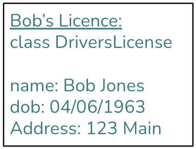
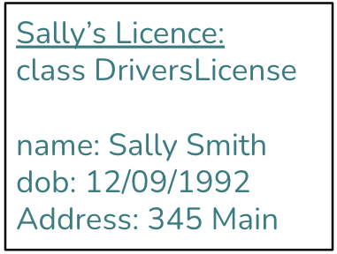
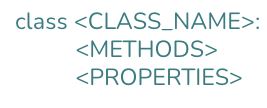

# Catch-up Week, Day 3: Classes Part I: Classes and Instances

## Introduction
---
[Yesterday](./day2-functions.md) (functions) and the [day before](./day1-loops_objects.md) (`for` loops and objects), we saw the importance of making code clear, reusable, and DRY.  Today we'll look at yet another way of achieving the same purpose.

Let's say you are in charge of the Illinois DMV.  You know that lots of people are going to need driver's licenses.  You also know that, in order to approve a license, you need three pieces of information:
1. Name
2. DOB
3. Address

How should you handle that?

Well, one option is to just tell people the information that you need and then have them write it down and give it back to you:<br/>


Here are some responses you might get:<br/>


If you only have a few licenses to process, the charming individual variation would probably lighten the tedium of processing paperwork all day long.  Unfortunately, Illinois is a big state with millions of drivers.

As a good bureaucrat, you spend the next six months designing the following form:<br/>


Well done!  You've distilled all the necessary information into a single, uniform, well... form.

Now when people submit their driver's licenses, they fill out the DMV's form with their specific information, thus creating their very own, unique driver's license application.

Wait, I thought we were talking about classes?  

Yes, a class is like a blank form.  It doesn't really do anything on its own.  You can't submit a blank driver's license form.  However, you can use it as a model to create a specific individual's application.  In OOP lingo, that would be called creating an "instance" of the application.

| Class | Instance 
| --------------------------- | ------------
| DMV Driver's Licence Form  | Bob's driver's license application |
|

Let's try relabeling things to make it a little bit clearer:<br/>


And when the class is instantiated:<br/>



So a class is like a form.  It tells you what kind of information is necessary for a given applicant.  But in order to actually do anything, you need to create an instance of the form by filling it out with a person's specific information.

## Structure of a Class
---
Here is the general schema for a class in Python:<br/>


You start with the keyword `class`, which lets Python know that you are making a class.  Then, just like a function, you need to give it a name (`CLASS_NAME`).  Then, like a function body, you need to describe what information your class has (`PROPERTIES`), and what it can do (`METHODS`).

With that in mind, let's turn our driver's license application into an actual class:
```python
class DriversLicense:
    name = ???
    dob = ???
    address = ???
```

Wait a minute, how do we actually go about doing that?

Before we can code up a working example, we're going to have to go into more detail about properties (variables) and actions (methods).

### The 3 kinds of variables (properties)
---
A variable in a class can be of 3 different types:
1. Class variable
2. Instance variable
3. Local variable

#### Class variables
A class variable belongs to the class itself.  In our driver's license example, a class variable might be the revision date for the form.  You can create a class variable just like you would a local variable in a function:
```python
class DriversLicense:
    LAST_REVISED = "02/02/2019"
```
Now every driver's license form will have the same `LAST_REVISED` date.

#### Instance variables
Instance variables will be those values that are specific to a given person's driver's license application.  This is the part of the form that the aspiring driver will fill out.  Instance variables are generally declared in the `__init__()` method:

```python
class DriversLicense:
    LAST_REVISED = "02/02/2019"

    def __init__(self, name, dob, addr):
        self.name = name
        self.dob = dob
        self.address = addr
```

Recall that the class variable `LAST_REVISED` is visible to everyone who applies.  Both Bob and Sally can see when the form was last revised. But when Bob fills out an application, Sally cannot see his `name`, `dob`, and `address`. She can only see that she needs to fill out her own `name`, `dob`, and `address`.

#### Local variables
The third kind of variable, the local variable, doesn't really belong to a class or an instance.  It's just a normal Python variable that you might use inside a function.


### Creating instances
---
With some exceptions, classes exist to create lots of instances.  So how do we create instances?

You simply call the class with any required arguments:

```python
bobs_license = DriversLicense("Bob", "04/06/1963", "123 Main")
```

That's really all there is to it.


### The 3 kinds of methods
---
A class can also have 3 different kinds of methods:
1. Class methods
2. Instance methods
3. Static methods

#### Class methods
Class methods are a bit strange, and frankly, you won't see them very often.  It's a method that works on the class itself, rather than a particular instance.  Let's say that government regulations require us to keep the original form submitted by the applicant, but our database requires names to be in all lower-case.  How might we implement that rather convoluted use-case?

We could create a class method that sanitizes data, and then re-creates a new database-friendly application instance.  In the end, you would get two application instances: a raw application instance and a sanitized one:

```python
class DriversLicense:
    LAST_REVISED = "02/02/2019"

    def __init__(self, name, dob, addr):
        self.name = name
        self.dob = dob
        self.address = addr

    @classmethod
    def clean(cls, name, dob, address):
        name = name.lower()
        return cls(name, dob, address)
```

We might use this class like so:
```python
bobs_info = ["Bob", "04/06/1963", "123 Main"]
bobs_raw_license = DriversLicense(*bobs_info) # the original application instance
bobs_sanitized_license = bobs_raw_license.clean(*bobs_info) # the sanitized application instance
```
Now we have two instances of the `DriversLicense` class.

Note that `clean` takes the class as its first parameter, rather than `self` as the `__init__` method does.

This would satisfy both our imagined government regulators who require us to keep the original submission, and our database administrator who wants to protect the integrity of the data.

#### Instance methods
Instance methods are the bread and butter of classes.  Let's say we want applications to be able to return all their essential information:

```python
class DriversLicense:
    LAST_REVISED = "02/02/2019"

    def __init__(self, name, dob, addr):
        self.name = name
        self.dob = dob
        self.address = addr

    @classmethod
    def clean(cls, name, dob, address):
        name = name.lower()
        return cls(name, dob, address)

    def get_all_data(self):
        return [self.name, self.dob, self.address]
```

The submit method takes an instance (self) as the first parameter, and it returns information about the instance.  If we want to do things with instance variables, or call other instance methods, then the method should be an instance method.

Here's how we would use it:
```python
bobs_info = ["Bob", "04/06/1963", "123 Main"]
bobs_raw_license = DriversLicense(*bobs_info)
bobs_sanitized_license = bobs_raw_license.clean(*bobs_info)
bobs_raw_data = bobs_raw_license.get_all_data()
bobs_sanitized_data = bobs_sanitized_license.get_all_data()
print(bobs_raw_data, bobs_sanitized_data) # ['Bob', '04/06/1963', '123 Main'] ['bob', '04/06/1963', '123 Main']
```

#### Static methods
Like class methods, static methods are far less common than instance methods.  Nevertheless, they have their place, and it's important to understand how they work.

When you declare a method to be static, you are basically saying: "This method does not need to know anything about the class or the instance." Why would you ever want to do that?

Sometimes you just need a helper method to perform some general task, such as computing the area of a triangle, reading from a file, or displaying information.  Such general functionality might not be directly related to your class or its instances.

Let's say that we want to write a method to format or display a driver's license application.  We certainly could make it an instance method, but we could also choose to create a more general display method that isn't really tied to either the class or an instance--it just kind of lives on the couch:

```python
class DriversLicense:
    LAST_REVISED = "02/02/2019"

    def __init__(self, name, dob, addr):
        self.name = name
        self.dob = dob
        self.address = addr

    @classmethod
    def clean(cls, name, dob, address):
        name = name.lower()
        return cls(name, dob, address)

    def get_all_data(self):
        return [self.name, self.dob, self.address]

    @staticmethod
    def display(name, dob, address):
        return f"""
        name: {name}
        dob: {dob}
        address: {address}
        """

bobs_info = ["Bob", "04/06/1963", "123 Main"]
bobs_raw_license = DriversLicense(*bobs_info)
bobs_sanitized_license = bobs_raw_license.clean(*bobs_info)
bobs_raw_data = bobs_raw_license.get_all_data()
bobs_sanitized_data = bobs_sanitized_license.get_all_data()

bobs_raw_display = bobs_raw_license.display(*bobs_raw_data)
bobs_sanitized_display = bobs_sanitized_license.display(*bobs_sanitized_data)
print(bobs_raw_display, bobs_sanitized_display)
```

Notice that `display` doesn't take in either `self` or `cls` as a first parameter.  It is just a regular function that happens to live in the class.


## Exercises
---
#### 1. Create a `CodePlatoonApplication` class <br/>
- It should have basic information about the applicant. 
- It should have a submit method.

#### 2. Create a `Statistics` class <br/>
- It should be initialized with an array of numbers. 
- It should have the following methods: average, median, and mode.

#### 3. Create a `BadGuy` class <br/>
- It should have properties such as hitpoints, damage, etc. 
- It should be able to attack, defend, etc.

