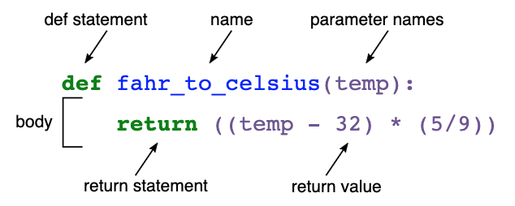

# Catch-up Week, Day 2: Functions

## Introduction
---
[Yesterday](./day1-loops_objects.md) we looked at loops as a way to save ourselves a bunch of typing.  Today we'll look at another tool that will help us do more of the same.

Let's say we run a bar and we need to check everyone's age before allowing them to enter.  Starting with Bob, Sally, and Frank from yesterday, we might try something like this:

```python
bob = {
  "name": "Bob",
  "age": 15,
  "hobbies": ["skiing", "falling", "getting up"]
}

sally = {
  "name": "Sally",
  "age": 35,
  "hobbies": ["sailing", "swimming", "not drowning"]
}

frank = {
  "name": "Frank",
  "age": 45,
  "hobbies": ["tennis", "running", "grunting", "falling", "getting up"]
}
```

```python
# Check everyone's age
if bob["age"] >= 21:
    print("Welcome Bob")
else:
    print("Sorry, Bob.  You can't come in")

if sally["age"] >= 21:
    print("Welcome Sally")
else:
    print("Sorry, Sally.  You can't come in")

if frank["age"] >= 21:
    print("Welcome Frank")
else:
    print("Sorry, Frank.  You can't come in")
```

This code will definitely keep us compliant with the state's regulations.  Unfortunately, it violates a higher law: DRY (Don't Repeat Yourself).

We have to write the same code to check everyone's age and either greet or refuse them.  We can do better.  Applying what we learned yesterday, we can considerably improve this by using a loop:

```python
people = [bob, sally, frank]

for person in people:
    if person["age"] >= 21:
        print(f'Welcome {person["name"]}')
    else:
        print(f'Sorry, {person["name"]}. You can\'t come in')
```

We've cut out a lot of the repetition, which is great.  But there's also other things we could improve.  For example, the age cutoff of 21.  It's not really clear in the code what that value is supposed to be.  We could change that by giving it an informative label:

```python
LEGAL_AGE = 21
people = [bob, sally, frank]

for person in people:
    if person["age"] >= LEGAL_AGE:
        print(f'Welcome {person["name"]}')
    else:
        print(f'Sorry, {person["name"]}. You can\'t come in')
```
Now it is more obvious what 21 actually is.

But what about the body of the `for` loop?  Is it immediately obvious what is happening?  Since it's a simple example, and we have the right cultural background, it probably is obvious.  But imagine a developer coming along from a country without a legal drinking age, etc.  In any case, we can make things clearer by labeling the content of the `for` loop's body.  How do we do that?

We use functions.  Functions are operations that we can package up, label, and use over and over again.  NOTE: There are anonymous functions, but we won't worry about that now.

```python
def welcome_if_legal_else_forbid(person):
    LEGAL_AGE = 21
    if person["age"] >= LEGAL_AGE:
        print(f'Welcome {person["name"]}')
    else:
        print(f'Sorry, {person["name"]}. You can\'t come in')
```

We immediately know the purpose of those operations just from reading the function's name.  Another benefit is that it simplifies our `for` loop:

```python
for person in people:
    welcome_if_legal_else_forbid(person)
```

Now the `for` loop only cares about iterating through the `people` array.  Everything else is taken care of by the function.


## Structure of a Function
---
Having seen at the usefulness of functions, let's take a look at their structure:<br/>


You tell Python that you are writing a function with the `def` keyword.  This is followed by the name of your function and the parameters that your function takes (if any).  

After that comes the body of your function.  The body of a function, like the body of a `for` loop, can be as long as you like.  At the end of your function body, you can optionally declare a `return` value.  If you do not explicitly declare a `return` value, Python will automatically return `None`.

### A quick note on return values
When you are first starting out programming--often in a repl such as [replit](https://replit.com/), it is easy to mistake <i>printing</i> a value for <i>returning</i> a value.  But it is important to sharply distinguish between printing a value and returning one.

What does this function return?
```python
print('hi')
```

Think about it for a second before you read on.

`print` is a built-in function that writes whatever parameters you give it to standard output (the terminal).  But it actually <i>returns</i> `None`.  That's right, if you print the return value of a call to print, you will get `None`:

```python
print(print('hi'))
```
The inner print call will execute, print "hi" to standard output, and return `None`.  Now the outer print call is basically `print(None)`.  That call will print out "None," and then also return `None`.

#### An embedded quick note on "side effects"
Printing is known as a "side effect."  We won't get into it now, but a side effect is something a function does that acts on something outside itself.  In this case, `print` changes standard output, and since standard output is outside of the function itself, `print` produces a side effect.  REST API calls and DOM manipulation are other common examples of side effects.

### Back to return values
Now that we are clear on returning a value from a function, let's refactor our current `welcome_if_legal_else_forbid` function.  To refresh your memory, here it is as we left it:

```python
def welcome_if_legal_else_forbid(person):
    LEGAL_AGE = 21
    if person["age"] >= LEGAL_AGE:
        print(f'Welcome {person["name"]}')
    else:
        print(f'Sorry, {person["name"]}. You can\'t come in')
```

Right now it only prints something to standard output.  What does it actually return?  If you guessed `None`, then you have been paying attention.  If we wanted to make `welcome_if_legal_else_forbid` a little bit more versatile, we could return a value, and then let the caller decide what to do with it (printing, or anything else).  Feel free to try it on your own first.

Hopefully it wasn't too painful:
```python
def welcome_if_legal(person):
    LEGAL_AGE = 21
    if person["age"] >= LEGAL_AGE:
        return f'Welcome {person["name"]}'
    else:
        return f'Sorry, {person["name"]}. You can\'t come in'
```

Then we could print the return value where we call it:
```python
for person in people:
    print(welcome_if_legal(person))
```

We could also do anything else that we can do with strings, giving us greater flexibility and reusability than we had when we just printed the values in `welcome_if_legal`:
```python
for person in people:
    msg = welcome_if_legal(person)
    yelled_msg = msg.upper()
    print(yelled_msg)
```


## Exercises
---
#### 1. Write a function that takes in two integers (n1 and n2) and returns the power of n1^n2. <br/>
- Example: 
```python
get_exp(2,3) 
# returns 8
```

#### 2. Write a function that takes in an integer and returns the number of digits in that integer. <br/>
- Example: 
```python
dig(947) 
# returns 3
```

#### 3. Write a function that takes any number of arguments, and prints each argument. <br/>

#### 4. Write a function that takes another function as an argument, and executes the passed function. <br/>