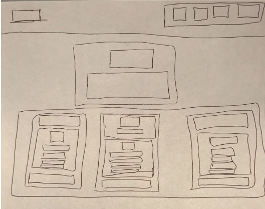

# Tuesday, June 15, 2021
## Video Resources
- [Week 5 Videos](https://www.youtube.com/watch?v=V2nozKafd5w&list=PLu0CiQ7bzwERdY3DZWm2QK2dodaqV6bvG)

## Topics Covered
- **CSS Advanced Topics**
- Understanding CSS pseudo-classes and how to interact with them
  - `link`
  - `visited`
  - `hover`
  - etc.
- Understanding CSS positioning and layouts
  - `Flexbox` and `grid layout`
- **Wireframing**
  - Wireframing is a quick and effective way to identify usability issues early on in your design process.
  - It allows you to determine the architecture of your HTML document
  - It allows you to determine which tags go where in your HTML document

## Goals
**Core**
- Understand the basic HTML file architecture
- Learn wireframing techniques to quickly sketch out a design plan

## Lesson

**Pseudo and Dynamic Classes**
- Pseudo and dynamic classes are created as a result of user actions. For example:

```HTML
a:link    { color: green; }
a:visited { color: yellow; }
```
- Let's create an html file, put this CSS in the `style` tag and see the above in action:

- The first line of code would change the color of the links on the page to green, and if those links had been previously visited, they would be yellow.

- A commonly used dynamic class is `hover`.

```HTML
a:hover {
  text-decoration: none;
  color: blue;
  background-color: yellow;
}
```

- The above code would cause links on the page to change colors only when hovered upon by the cursor.

**Positioning**

- You may have noticed that you (at the moment) can only really put elements on the page _vertically_. Positioning allows us to move elements to different parts of the browser window.

- The CSS property is `position`. Giving an element a `relative` position means that the element can be repositioned
_relative_ to its parent. Another value, `absolute` pulls the element out of the flow of the document and it basically
lives in its own world (or relative to the closest relatively positioned parent). A `fixed` position keeps the element
in one place, even if the window is scrolled.

- Using the HTML code below, style the navbar so that it appears on the left. A great place to implement the code above is on [CODEPEN](https://codepen.io/). Try making your navbar on there.
```HTML
<div class="navigation">
  <ul>
    <li><a href="/about">About Us</a></li>
    <li><a href="/contact">Contact</a></li>
  </ul>
</div>
<div class="content">
  <h1>Welcome to Interstellar Travel, Inc.</h1>
  <p>
    Lorem ipsum dolor sit amet, consectetur adipisicing elit. Eos enim quam dignissimos officiis, nam ex molestiae
    adipisci aliquam officia natus, praesentium. Ipsa quo, inventore autem, quod neque esse quasi debitis!
  </p>
</div>
```

**Flexbox, Grid & Floats**

- There are a few different CSS modules and properties that allow us to shift elements on the screen in a specific manner. They are Flexbox, Floats & Grid. One isn't necessarily better than the other but they do function in different ways.

__Flexbox__

```css
.container {
  display: flex; /* or inline-flex */
  justify-content: space-evenly; /* spaces the child elements evenly in relation to the parent container
}
```

__Float__

- `float` allows us to shift the element box to the right or the left of a line
with the surrounding content floating around it.

- `float: left;` Takes the element out of the normal document flow and puts it on the left.

- `float: right;` Does the same and puts it on the right. Try both of these out with your navbar!

**How do we know what tags to use and where they go? (Wire Framing/Boxing)**

Below is a static webpage that we want to replicate in HTML. Before we just jump right into writing out a HTML file lets develop a visual plan on what tags and elements we need to use.

Using a piece of paper, we draw a box where each incapsulating tag should go for the below static webpage.


__Boxing example:__
Every single box will be a __tag__ within your HTML `<body>` __element__.



__Boxing to HTML example:__

```html
<!-- index.html  -->
-> HTML Head Tag goes here
<body>
  <nav>
    <p>Company Name</p>
    <div>
      <p>FEATURES</p>
      <p>ENTERPRISE</p>
      <p>SUPPORT</p>
      <button>Login</button>
    </div>
  </nav>

  <!-- ... The rest of your HTML -->

</body>

```

**Styling with Bootstrap**

As web sites become more complicated, so does the task of handling styles and layout. Enter CSS frameworks. A CSS framework is just a set a pre-defined styles (and sometimes Javascript functions) that help us keep styles consistent and responsive. Some popular frame-works are Google's [Materialize](https://materializecss.com/), [Foundation](https://foundation.zurb.com/), and the one we'll explore today, Twitter's [Bootstrap](https://getbootstrap.com/). It's important to note that, though frameworks can seem like magic, they are just using regular CSS and JS under the hood. We can apply these pre-written styles by adding special classes to our HTML elements.

## Assignments
- [Wire Framing/Boxing Exercise](https://github.com/oscarplatoon/wire-framing-boxing-exercise)
- [LinkedIn HTML](https://github.com/oscarplatoon/linkedin-html)
- [Styling with Bootstrap](https://github.com/oscarplatoon/bootstrap)


