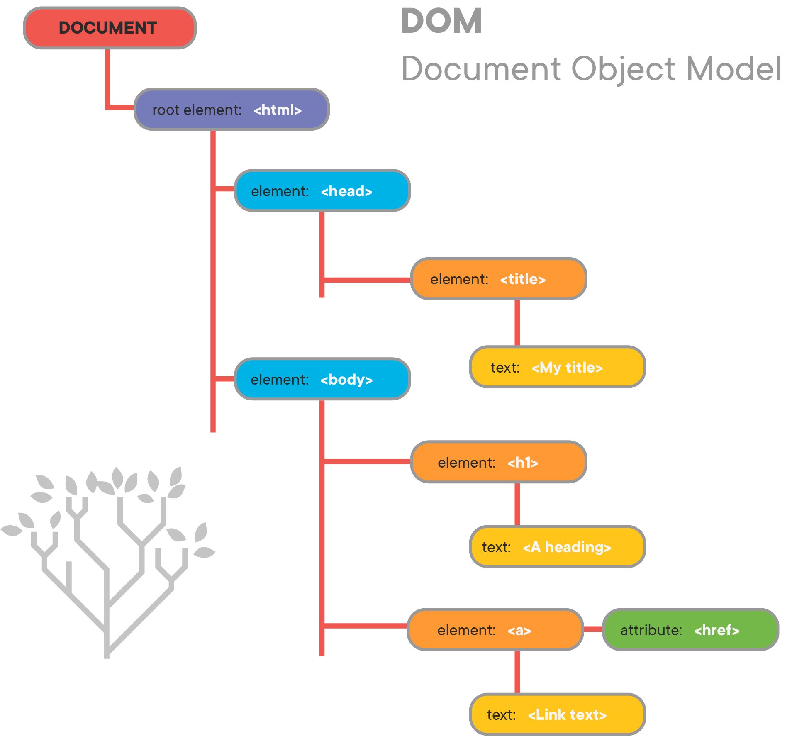

# Wednesday, June 16, 2021

## Video Resources
- [Week 5 Videos](https://www.youtube.com/watch?v=V2nozKafd5w&list=PLu0CiQ7bzwERdY3DZWm2QK2dodaqV6bvG)

## Topics Covered
- **Using JavaScript with HTML**

## Goals
**Core**
- Understand what the DOM (Document Object Model) is
- Understand how to use JavaScript to manipulate the DOM
- Understand how to use your browser's local storage

## Lesson

### JavaScript
- We've been using [node](https://en.wikipedia.org/wiki/Node.js) to run our javascript code in the terminal. This is a relatively new development for Javascript. Originally, it was created to run exclusively in the browser so that developers could add behavior to web pages. Since then, it has become the primary language of the web. Let's look at how Javascript runs in the browser, and how we can use it to make our web pages more dynamic.

**The DOM**
- Before we can start using Javascript on our front end, we need to understand what the DOM is and how it works. When the browser receives a webpage (HTML and CSS) it breaks it up into a tree like structure called the Document Object Model (DOM).



- Each element in our HTML document is represented as a 'node' in the DOM. We can use Javascript to access these nodes and manipulate them. Let's start with a simple HTML file. Create a file called `index.html` and paste the following code:

```HTML
<!DOCTYPE html>
<html>
  <head>
    <title>My HTML Page</title>
    <script>
      const showGreeting = () => {
        let nameInput = document.getElementById("input-name")
        let greetingOutput = document.getElementById("output")
        if (nameInput && greetingOutput) {
          greetingOutput.innerHTML = "Hello " + nameInput.value + "!"
        }
      }
    </script>
  </head>   
  <body>
    <input id="input-name" placeholder="name"/>
    <button onclick="showGreeting();">Submit</button>
    <div>
      <p id="output"></p>
    </div>
  </body>
</html>
```

**External JavaScript**
- We have included our JavaScript logic internally to our HTML document. This usually isn't the best organization, so let's move our logic to a separate file ("scripts.js") and link it externally...
```HTML
<!-- index.html -->
<!DOCTYPE html>
<html>
  <head>
    <title>My HTML Page</title>
    <script src="scripts.js" defer></script>
  </head>   
  <body>
    <input id="input-name" placeholder="name"/>
    <button onclick="showGreeting();">Submit</button>
    <div>
      <p id="output"></p>
    </div>
  </body>
</html>
```

```javascript
// scripts.js
const showGreeting = () => {
  let nameInput = document.getElementById("input-name")
  let greetingOutput = document.getElementById("output")
  if (nameInput && greetingOutput) {
    greetingOutput.innerHTML = "Hello " + nameInput.value + "!"
  }
}
```
- Note that we have a `defer` keyword included in our `script` tag. This tells the browser to only load the javascript logic after the HTML document has fully loaded. This is usually preferred, since we may want to interact with the DOM when the javascript logic loads and executes, so we need to ensure that the DOM has fully been created. 

**Accessing elements from the DOM**
- We're using the `getElementById()` method on the `document` object in the code above, to retrieve the element model that we're interested in. Common methods for retrieving items from the DOM are:
  - `document.getElementById()`  ...retrieves an element object by the set `id` attribute (should be unique)
  - `document.getElementsByClassName()`  ...retrieves all elements by the set `class` attribute (returns an array element objects)
  - `document.getElementsByTagName()`  ...retrieves all elements that use the specified tag name (returns an array of element objects)
  - `document.querySelector()` ...retrieves an element object that match the css selector (generally use with id-selectors)
  - `document.querySelectorAll()` ...retrieves all element objects that match the css selector

Examples:
- [document.getElementById()](https://developer.mozilla.org/en-US/docs/Web/API/Document/getElementById)
- [document.getElementsByClassName()](https://developer.mozilla.org/en-US/docs/Web/API/Document/getElementsByClassName)
- [Other Document Object Properties and Methods](https://www.w3schools.com/jsref/dom_obj_document.asp)

**Events**
- The browser is always listening, always keeping track of user behavior. It can tell you when a user has clicked on something, when the mouse enters or leaves an element's bounds, the location of the mouse at any given time, and much more. We can tap into these events and use them to react to user behavior. We do that by calling a function called an [Event Listener](https://developer.mozilla.org/en-US/docs/Web/API/EventListener).

- Let's modify our code so that the output content clears when we click on it
```javascript
// scripts.js
window.onload = () => {
  let greetingOutput = document.getElementById("output");
  if (!greetingOutput)
    return;

  greetingOutput.addEventListener("click", () => { 
    // clear greeting when we click on it
    greetingOutput.innerHTML = ""
  })
}

// ...
```

- We call the `addEventListener()` function on our element and pass it two arguments. The first is the type of event we are listening for. (You can find a full list of events [here](https://developer.mozilla.org/en-US/docs/Web/API/EventListener)). The second argument is a function that we want to run when the event is triggered. This function will take one argument of its own, an `event` object that holds some information about the event itself.

### Local Storage
- Web pages often want to persist data on the client-side so that it doesn't have to make extra requests from the serer. The local storage of a browser is one place where we can store information between sessions. Other locations include session storage and saving cookies. 

- Local Storage
  - Uses key-values pairs for storing and retrieving items
    - `localStorage.setItem(key, value)`
    - `value = localStorage.getItem(key)`

```javascript
// scripts.js

const nameKey = "name"

window.onload = () => {
  let greetingOutput = document.getElementById("output");
  if (!greetingOutput)
    return;

  // look for a name value in local storage
  let name = localStorage.getItem(nameKey)
  if (name !== "") {
    // initialize greeting output if we already have a name value
    greetingOutput.innerHTML = "Hello " + name + "!"
  }

  greetingOutput.addEventListener("click", () => { 
    // clear greeting when we click on it
    greetingOutput.innerHTML = ""
  })
}

const showGreeting = () => {
  let nameInput = document.getElementById("input-name")
  let greetingOutput = document.getElementById("output")
  if (nameInput && greetingOutput) {
    let name = nameInput.value
    
    // store name in local storage
    localStorage.setItem(nameKey, name)

    // greet the user
    greetingOutput.innerHTML = "Hello " + nameInput.value + "!"
  }
}
```

## Assignments
- [LinkedIn JS](https://github.com/oscarplatoon/linkedin-js)
- [Browser Storage](https://github.com/oscarplatoon/browser-storage)
- [Guess A Number](https://github.com/oscarplatoon/number-guessing-game)
**Stretch**
- [Create a Static Webpage (weeklong challenge)](https://github.com/oscarplatoon/static-webpage)


