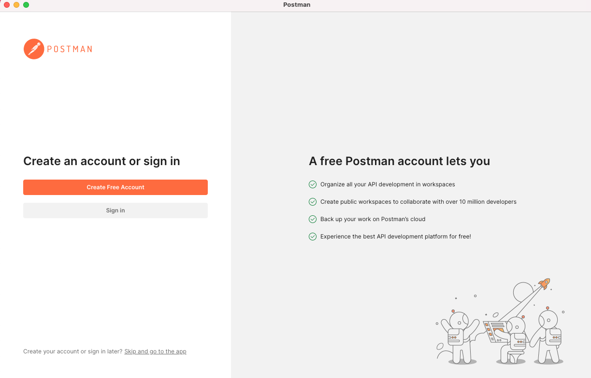
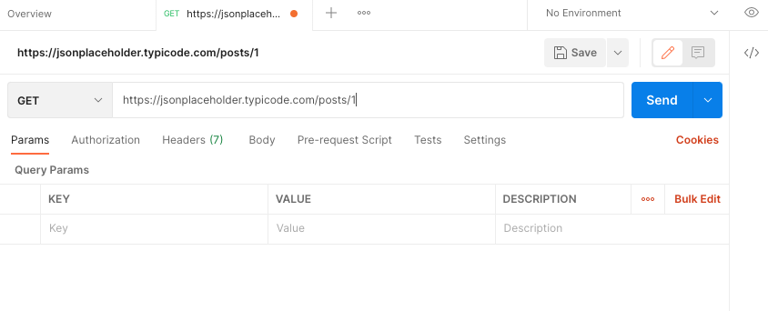
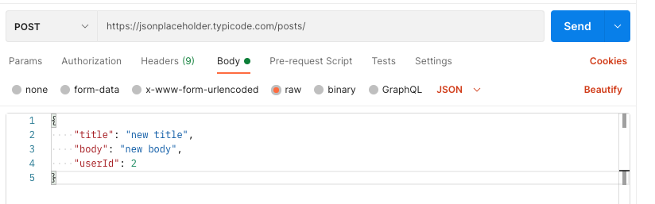
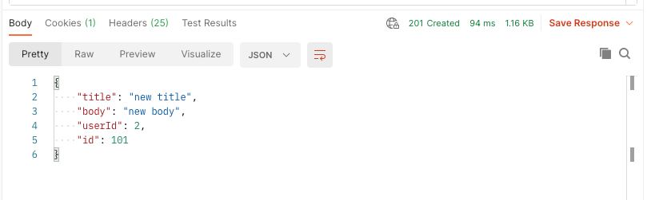
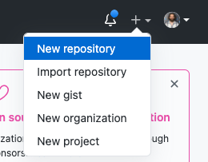
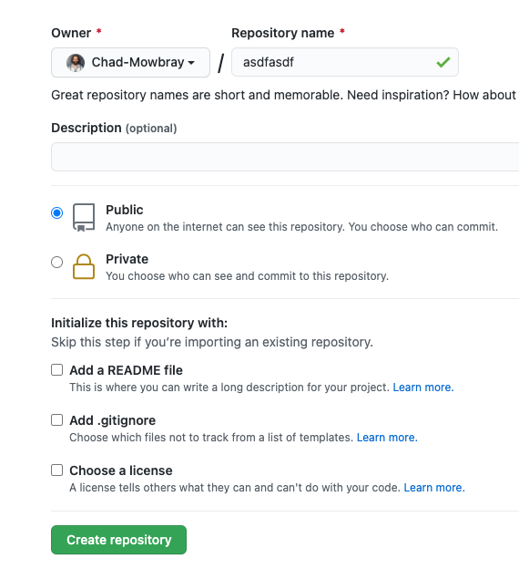
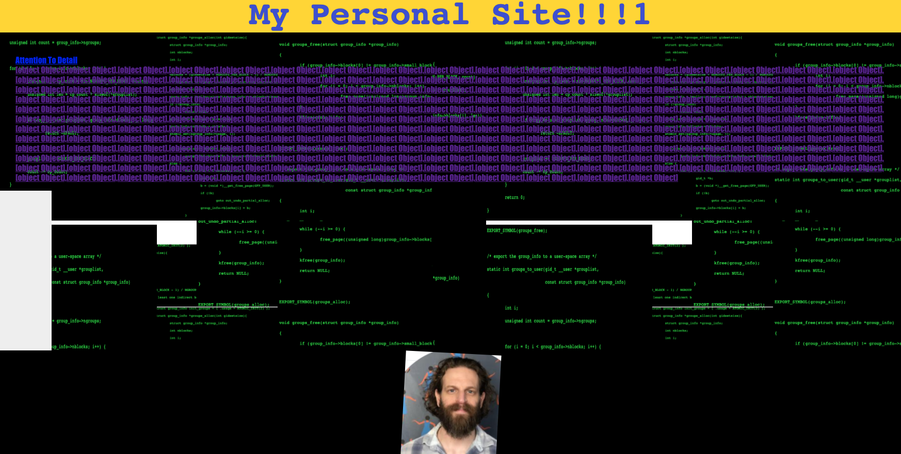

# Thursday, June 17, 2021

## Video Resources
- [Week 5 Videos](https://www.youtube.com/watch?v=V2nozKafd5w&list=PLu0CiQ7bzwERdY3DZWm2QK2dodaqV6bvG)

## Topics Covered
- HTTP introduction
- **cURL**
  - Command line utility for making HTTP (and other protocol) requests.
- **Postman**
  - A commonly used application for API development.
- **Building a site on Github pages**
  - Github pages is one of many ways to host a site, allowing you to take files on your local computer and make them accessible to anyone with an internet connection.

## Goals
**Core**
- Understand the basics of HTTP
  - What does the structure of an HTTP request look like, and what is the purpose of the `body` and `header`?
  - What action verbs does HTTP use, and when should you use them? `GET`, `POST`, etc.
- Learn some tools (other than the browser) for testing APIs
- Know how to build and launch a site using Github Pages

**Stretch**
- Begin building out a static portfolio webpage using HTML, CSS, and Javascript

## Lesson
- [HTTP Slides](https://docs.google.com/presentation/d/18XgB39IqvBFXfJYKQdc5j2ZzlZBeOH_enugni6b__Cs/edit?usp=sharing)

### cURL
[cURL](https://curl.se/book.html) is a command line utility that will pretty much be on any Unix-based sytem.  It is a convenient and easy-to-use tool that can come in handy during web-development.  It can be run in scripts or in one-off commands, like any other command line tool.

Here are some basic things you can do
- Make a GET request and get the HTML:
```bash
curl www.example.com
```
- For a simple site like www.example.com, you can immediately run your own copy locally:
```bash
curl www.example.com > myExampleSite.html && open myExampleSite.html
```
- You can also get a more detailed look at what is happening (including the request and response headers) by using the "verbose" flag:
```bash
curl -v  www.example.com
```
- If you really want to go nuts with detail, you can actually see every single byte in hexidecimal numbers.  This will be saved to a file (in this case called "dumpFile"):
```bash
curl --trace dumpFile  www.example.com
```
- And if you really, really have a thing for numbers and letters, you can see the TLS handshake process play out when you go to a secure site:
```bash
curl --trace dumpFile  https://www.duckduckgo.com
```

### Postman
[Postman](https://www.postman.com/downloads/) is a widely used tool for testing and developing APIs.  Like cURL, it enables you to make requests to endpoints without using a browser.  You might find that it makes development and debugging easier.

When you first open the application, you will probably see this screen:<br/>


For now, I'll just skip the sign in.  

You can make a request to any URL (including localhost).  We'll use [everyone's favorite dummy API](https://jsonplaceholder.typicode.com):<br/>


Our GET request returns JSON (but HTML works fine too), and we can see it at the bottom of the window:<br/>


We can also make POST requests.  There are a lot of options for sending data.  Here we're typing in our own JSON object (according to the API's specifications):<br/>


And here is the response:<br/>


We get a lot of information about the response, including: status (201 Created), time, headers, cookies.  This information can be extremely handy when developing.

### Github Pages
Getting a static site up and running on Github Pages is fairly simple.  When we get to React, you can also host a React application, but the process is a bit more complicated.

For now, all you need to do is:
1. Initialize a new local git repository
2. Write the code (typically: index.html, styles.css, app.js)
NOTE: Github Pages will look for an entrypoint called "index.html", so that file must be present.
3. Make a commit.
4. Create a new Github repository in your account.
  - While logged in to Github, click the "+" sign at the top right of the page:<br/>

  - Choose "New repository"<br/>

  - Name your repository (the name will be part of the url)<br/>

  - Assuming that you have already made a commit, run the "git remote add origin ..." command on your machine
  - Optionally, change the name of the master branch to main.
  - Push to whatever is the primary branch (master or main)
5. If you refresh the page, you should be able to see your code in your new Github repo.

Once you have your repo on Github, you'll need to create a new branch called "gh-pages", so Github Pages knows that you want your repo hosted.

1. On your local machine, create a new branch called gh-pages: 
```bash
git checkout -b gh-pages
```
2. Push the gh-pages branch up to your Github repo:
```bash
git push origin gh-pages
```
Your Github repo should now have two branches:<br/>


Eventually, (give it 10 minutes or so before you start panicking) you should see something in "Environments" in the right column of the repo's page:<br/>


From there, you should be able to click on "View deployment" and marvel at your handiwork:<br/>


(Don't worry if your site doesn't look as professional as this one.)

## External Resources
- [Github Pages](https://pages.github.com/)
- [cURL book](https://everything.curl.dev/)
- [Postman docs](https://learning.postman.com/docs/getting-started/sending-the-first-request/)

## Assignments
- [Simple Todo](https://github.com/oscarplatoon/simple-todo)  
- [Create a Static Webpage](https://github.com/oscarplatoon/static-webpage)
- Stretch challenges:
  - [HTTP Server One](https://github.com/oscarplatoon/http-server-one)
  - [HTTP Server Two](https://github.com/oscarplatoon/http-server-two)
  - [HTTP Server Three](https://github.com/oscarplatoon/http-server-three)


