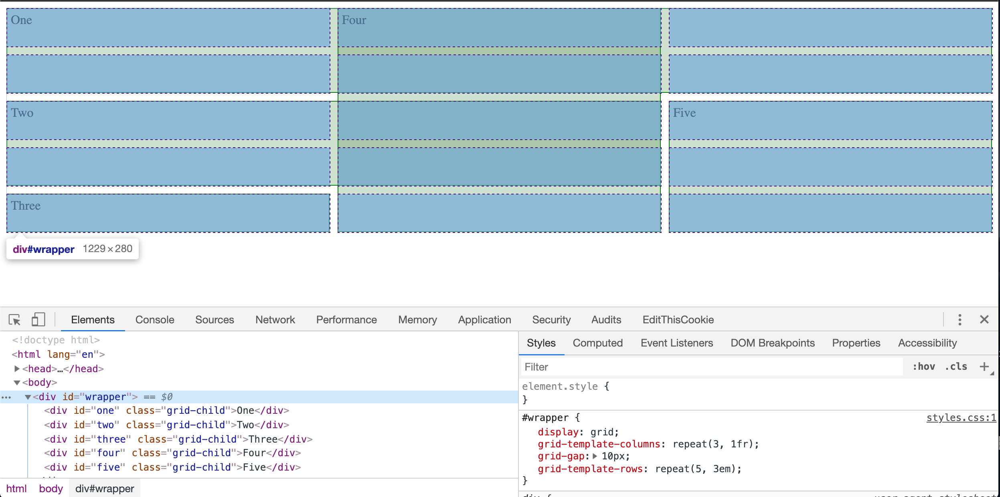

Thursday, June 6, 2019
=======================
# Front end
You may already be familiar with how the interent works on a high level. 
- You enter a url like `www.imdb.com` into your web browser. 
- Your browser makes an `HTTP GET` request to a server.
- The server returns all the code for the Internet Movie Database website (or whatever website you requested). 
- Your browser then takes that code and runs it to displays the page. 

This week we are going to spend some time breaking down these steps even further. We'll start by looking at that code that comes back from the server. We call all this code that builds the actual page 'front end' code. 


## HTML - Hypertext Markup Language
HTML is a markup language that forms the bones of a web page. It helps define the overall structure of the page. It's not a fully fledged programming language like Javascript or Python. Instead, it's a way to add semantic meaning to your content. 

Let's see it in action. Create a new file called `index.html`. Next, we'll add one line, a string of text wrapped in our first HTML tag. 

```HTML
<!-- index.html -->
<h1>Hello World</h1>
```
This tag is called a header tag. Notice how it wraps around our content. Most HTML tags have opening and closing tags like our `h1`. 

If we open this document in a browser we should see 'Hello World' on a white background. Raw HTML doesn't look pretty and that's ok. By and large, the way a web site looks is determined by CSS. We'll get to that in a bit. For now, let's add a few more tags to `index.html`. 

```HTML
<h1>Hello World</h1>
<h2>Hello World</h2>
<h3>Hello World</h3>

```
Header tags go from `<h1>` to `<h6>`. By default, the browser will render an `<h1>` larger than an `<h2>`. This does not mean it always has to be that way. We can easily override these default styles with CSS and make these elements any size we want. Instead of thinking about style when we write HTML, we should be thinking about meaning. Is this content a heading? A paragraph? A section?

## Head and Body
The HTML we've written so far is working just fine, but it is not complete. Let's take a look at a properly formatted HTML page. Replace your code in `index.html` with the code below. 

```HTML 
<!DOCTYPE html>
<html lang="en">
<head>
  <meta charset="UTF-8">
  <meta name="viewport" content="width=device-width, initial-scale=1.0">
  <meta http-equiv="X-UA-Compatible" content="ie=edge">
  <title>Code Platoon!</title>
</head>
<body>
  <h1>Hello World<h1/>
</body>
</html>

```
All HTML documents start with a `Doctype` declaration. This let's the browser know everything that follows is part of an HTML document. Doctype always sits at the top and it does not have a closing tag. 

Next comes our `html` tag. This wraps around the entire document. Notice the closing `html` tag at the very bottom. It's common in HTML to nest tags within tags. We'll be seeing this a lot. 

The next tag is the `head` tag. The head of the html document contains all the links and meta data the page needs. Nothing in the head tag will appear on the final page. Some things that can go in the head include: links to style sheets, `meta` tags that provide data for screen readers or for [SEO](https://en.wikipedia.org/wiki/Search_engine_optimization). The `title` tag in the head is what gets displayed in the browser tab. 

After the `head` tag comes the `body`. This is the meat of the document. Everything nested inside the `body` tag is what will show up on the actual page. In this case it's just our `<h1>` from before. 

## Attributes 
All tags can have attributes. These are set in the opening tag and are used to manipulate a tag's appearance, control its behaviour, or add additional meaining to content. Two you'll need to be aware of right away are `class` and `id`.
```HTML
<p id="article-44" class="article">
  Today there was news in the world and it happend like this....
</p>
```
`id` is a unique identifier for an HTML element. It can be set to any string, but you can't have two of the same `id` on the same page. `class`es are used to lable groups of related content. You can have multiple elements with the same `class` on a page. We'll cover more attributes as we continue to explore front end code. 

## Common Tags 
There are [over a hundred](https://developer.mozilla.org/en-US/docs/Web/HTML/Element) different html tags. We won't be going over all of them. Let's go over a few common ones. 

### div
A `<div></div>` tag is a general container. It is used to encapsulate other elements and to break your page up into sections. 

### img 
An `` tag loads an image on a page. It requires one attriburte, `src`, with the path to the image. Notice that this is an example of 'self closing tag'.

```HTML
 ``
```

### a 
`a` tags are for links. They require at least one attribute, `href`, with the path for the link. 
```HTML
 `<a href="https://www.google.com/">Click to Visit Google</a>`
```

### ul 
`ul` tags are unordered lists. Use them with `li` (list item) tags to create lists of things!
```HTML 
<ul id="pb-chkn-wffls" class='recipe-ingredients'>
  <li class="ingredient" >1/2 oz Peanut Butter</li>
  <li class="ingredient" >18 Chicken breasts</li>
  <li class="ingredient" >1 tsp Eggo Waffles</li>
  <li class="ingredient" >Another Chicken Breast</li>
</ul>
```
### p 
This is a paragraph tag. 
```HTML
<p>This is a paragraph of text in a p tag.</p>
```

### form 
Forms are how we get user input. They are made up of different types of `input` tags. We'll talk more about how they work and how to get them to send data in the future. 
```HTML
<form action="/my-handling-form-page" method="post">
  <div>
    <label for="name">Name:</label>
    <input type="text" id="name" name="user_name">
  </div>
  <div>
    <label for="mail">E-mail:</label>
    <input type="email" id="mail" name="user_mail">
  </div>
  <div>
    <label for="msg">Message:</label>
    <textarea id="msg" name="user_message"></textarea>
  </div>
</form>
```

# CSS - Cascading Style Sheets
CSS is the language we use to handle the style and layout of our web pages. We apply CSS rules to HTML elements by first using a **selector** to target an object or group of objects. Then, we can set properties on the element/elements we have selected. 

## Adding Styles

You can apply CSS directly to the element, but this is usually discouraged. More commonly we write CSS in a separate file that we then link to in the `<head>` tag. Create a new file in the same directory as your `index.html` called `styles.css`. Then put a link in the head of your HTML file. 

```HTML
<!-- index.html -->
<!DOCTYPE html>
<html lang="en">
<head>
  <meta charset="UTF-8">
  <meta name="viewport" content="width=device-width, initial-scale=1.0">
  <meta http-equiv="X-UA-Compatible" content="ie=edge">
  <link rel="stylesheet" href="./styles.css"> <!-- A link to our new style sheet  -->
  <title>Code Platoon!</title>
</head>
<body>
  <h1>Hello World<h1/>
</body>
</html>

```
Now we can use CSS selectors to select our `<h1>` and change the text to red. 

```CSS
/* styles.css */
h1 {
  color: red;
}
```
If you've hooked this all up correctly, you should be able to open `index.html` in your browser and see "Hello World" appear in red. 

### Using id and class 
Usually you don't want to target elements by their html tag. Instead, we use ids and classes. First, let's refactor our HTML so that we have a few more elements to play with. We'll also add some ids and classes to those elements. 

```HTML
<!DOCTYPE html>
<html lang="en">
<head>
  <meta charset="UTF-8">
  <meta name="viewport" content="width=device-width, initial-scale=1.0">
  <meta http-equiv="X-UA-Compatible" content="ie=edge">
  <link rel="stylesheet" href="./styles.css"> <!-- A link to our new style sheet  -->
  <title>Code Platoon!</title>
</head>
<body>
  <h1 id='main-heading'>Hello World<h1/>
  <h2 id='subheading-one' class='subheading' >I'm a subheading!</h2>
  <p class='article-body'>I'm a paragraph with a bunch of interesting content.</p>
  <h2 id='subheading-two' class='subheading'>I'm another subheading!</h2>
  <p class='article-body'>I'm another paragraph with even more of interesting content.</p>
</body>
</html>
```
Now we can write some more CSS. We can target a class by using a period `.` followed by the class name (`.article-body`) and we use `#` to target ids (`#main-heading`).

```CSS
#main-heading {
  color: green;
  font-size: 80px;
  background-color: blue;
}

.article-body {
   border: solid orange;
   text-align: center;
}

```
We now have one of the ugliest web pages ever. Notice that each selector can have multiple properties defined. There are hundreds of properties you can set to create your web page. [This link](https://www.w3schools.com/cssref/) has a good list of what is available. 

## Positioning Elements
In addition to styling, we can also use CSS to position elements. There are two different kinds of elements when we talk about positioning: inline and block. 
### Block 
Block elements stack on top of each other and extend the entire width of their parent element. Because of the nested nature of HTML, we refer to the outside element as the parent and any nested elements as children. So in the example below, the `div` is the parent and the `h1` is the child. 
```HTML
<div class='container'>
  <h1>My Heading</h1>
</div>
```
In this case the `h1` is a block level element and it will take up the full width of the `div`. We can control width and height with CSS. 

```CSS
.container {
  width: 400px;
  height: 200px
}
```
This will set the `div` to be 400 pixels wide and 200 pixels high. If we don't specify any width or height for the `h1`, it will simply expand to fill the `div`. 

### Inline 
Inline elements do not start a new line. They can be set right next to each other and only expand to the size of their content. Copy the code below and you'll see that all the `h1` elements will stack on top of each other, while the spans will line up one after the other. 

```HTML
<div class='container'>
  <h1>I'm block level!</h1>
  <h1>I'm block level!</h1>
  <h1>I'm block level!</h1>
  <span>I'm inline!</span>
  <span>I'm inline!</span>
  <span>I'm inline!</span>
  <span>I'm inline!</span>
</div>
```
### CSS Grid 
Positioning elements with CSS used to be very difficult. [The old way](https://www.w3schools.com/css/css_positioning.asp) relied heavily on positioning elements releative to other elments. Eventually [flex box](https://www.w3schools.com/Css/css3_flexbox.asp) came along as a way to break pages up into columns. Since then, [CSS Grid](https://css-tricks.com/snippets/css/complete-guide-grid/) has emerged as the best way to position elements on the page. CSS Grid allows you to break elements up into columns and rows. Let's replace everything in our `index.html` file with the code below. 

```HTML
<html lang="en">
<head>
  <meta charset="UTF-8">
  <meta name="viewport" content="width=device-width, initial-scale=1.0">
  <meta http-equiv="X-UA-Compatible" content="ie=edge">
  <link rel="stylesheet" href="./styles.css"> <!-- A link to our new style sheet  -->
  <title>Code Platoon!</title>
</head>
<body>
  <div id='wrapper'>
    <div id='one' class='grid-child'>One</div>
    <div id='two' class='grid-child'>Two</div>
    <div id='three' class='grid-child'>Three</div>
    <div id='four' class='grid-child'>Four</div>
    <div id='five' class='grid-child'>Five</div>
  </div>
</body>
</html>
```
We wrap our elements in a `div` with an id `wrapper`. Now we can update our CSS file to use Grid. 
```CSS
#wrapper {
  display: grid;
  grid-template-columns: 1fr 1fr 1fr;
  grid-gap: 10px;
  grid-template-rows: 80px 80px 80px 80px 80px  ;
}
```
Then we can set that `div`'s `display` property to use CSS Grid. When we set an element up to use grid, all the child elements can now be positioned inside of that element according to the grid we define. `grid-template-columns` and `grid-template-rows` allow us to define our grid however we want. Here we are setting three columns (how ever many values we provide will determine the number of columns. Same with rows.) We are using [`fr`](https://css-tricks.com/introduction-fr-css-unit/) for our columns. This is a handy unit of measurement that takes into account our `grid-gap` and calculates even columns based on the browser width. Our columns do not alwasy need to be the same size.

Next, we set `grid-gap`. This defines the space between each column. Lastly, we use pixel units to define five rows for our grid. 

One quick refactor we can make here is to take advantage of CSS `repeat()` function. This function takes two arguments. `repeat(amount of times to repeat, thing to repeat)`
```CSS
#wrapper {
  display: grid;
  grid-template-columns: repeat(3, 1fr);
  grid-gap: 10px;
  grid-template-rows: repeat(5, 80px);
}
```
This is a little bit more readable and will make it easier to make changes down the line. 

Now that we have our grid set up we can position the child elements any way we want by setting `grid-column` and `grid-row`. Add this code to your `styles.css` and open `index.html` in your browser.

```CSS
#wrapper {
  display: grid;
  grid-template-columns: repeat(3, 1fr);
  grid-gap: 10px;
  grid-template-rows: 80px 80px 80px 80px 80px ;
}
/* some styles to help us see how the elements are positioned releative to each other. */
.grid-child {
  background-color: rgba(0,100,0, .2);
  border: solid green .5px;
  padding: 5px;
}

#one {
  grid-column: 1/4;
  grid-row: 1/3;
}

#two {
  grid-column: 1/3;
  grid-row: 3/5;
}

#three {
  grid-column: 1;
  grid-row: 5
}

#four {
  grid-column: 2;
  grid-row: 1/6;
}

#five {
  grid-column: 3;
  grid-row: 3/6
}
```
When we set `grid-column` on `#one` we are saying that we want this element to start at column one and extend to column 3. We use that same logic for `grid-row`. Play around with the values until you feel you have an understanding of how this works, then, design your own layout for these elements. 

#### Chrome Dev Tools - Grid
Most browsers, including Chrome, support CSS Grid. If you open the Chrome dev tools and click on an element that has its `display` set to `grid`, you'll see a nice outline of the grid you are working with. This can be really helpful when debugging.  


### Video Resources (Echo Platoon)
- [Week 5 Videos](https://www.youtube.com/watch?v=u5UT7jBwbEU&list=PLu0CiQ7bzwESK8JWt1KVzAHzjo7cVhs-f)

## Challenges
* [HTTP Server One](https://github.com/indiaplatoon/http-server-one)
* [Grid Garden game](http://cssgridgarden.com/)
* [Make A Circle](https://github.com/indiaplatoon/make-a-circle)
* [Top Ten](https://github.com/indiaplatoon/top-ten)
* [Linkedin HTML](https://github.com/indiaplatoon/linkedin-html)
* [Recreate hacker news](https://github.com/indiaplatoon/html-sectioning) (stretch)


## Resources
* [Slides](https://docs.google.com/presentation/d/18XgB39IqvBFXfJYKQdc5j2ZzlZBeOH_enugni6b__Cs/edit?usp=sharing)
* [Learn Grid Layout](http://learncssgrid.com/) (tutorial like `learn CSS layout`)
