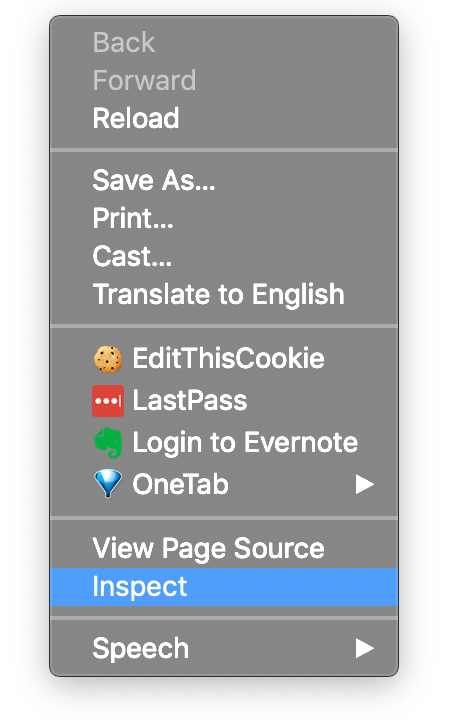

Tuesday, June 2, 2020
=======================
### Video Resources (Kilo Platoon)
- [Week 5 Videos](https://www.youtube.com/playlist?list=PLu0CiQ7bzwEQd8JEdJEAcoJzLSwvNO46m)

## HTML + CSS Continued

### Pseudo and Dynamic Classes

Pseudo and dynamic classes are created as a result of user actions. For example:

```HTML
a:link    { color: green; }
a:visited { color: yellow; }
```
Let's create an html file, put this CSS in the `style` tag and see the above in action:

The first line of code would change the color of the links on the page to green, and if those links had been previously
visited, they would be yellow.

A commonly used dynamic class is `hover`.

```HTML
a:hover {
  text-decoration: none;
  color: blue;
  background-color: yellow;
}
```

The above code would cause links on the page to change colors only when hovered upon by the cursor.

### Positioning

You may have noticed that you (at the moment) can only really put elements on the page _vertically_.
Positioning allows us to move elements to different parts of the browser window.

The CSS property is `position`. Giving an element a `relative` position means that the element can be repositioned
_relative_ to its parent. Another value, `absolute` pulls the element out of the flow of the document and it basically
lives in its own world (or relative to the closest relatively positioned parent). A `fixed` position keeps the element
in one place, even if the window is scrolled.

Using the HTML code below, style the navbar so that it appears on the left. A great place to implement the code above is on [CODEPEN](https://codepen.io/). Try making your navbar on there.
```HTML
<div class="navigation">
  <ul>
    <li><a href="/about">About Us</a></li>
    <li><a href="/contact">Contact</a></li>
  </ul>
</div>
<div class="content">
  <h1>Welcome to Interstellar Travel, Inc.</h1>
  <p>
    Lorem ipsum dolor sit amet, consectetur adipisicing elit. Eos enim quam dignissimos officiis, nam ex molestiae
    adipisci aliquam officia natus, praesentium. Ipsa quo, inventore autem, quod neque esse quasi debitis!
  </p>
</div>
```

### Floats

The last big piece of this puzzle are floats. `float` allows us to shift the element box to the right or the left of a line
with the surrounding content floating around it.

`float: left;` Takes the element out of the normal document flow and puts it on the left.

`float: right;` Does the same and puts it on the right. Try both of these out with your navbar!


# Javascript
We've been using [node](https://en.wikipedia.org/wiki/Node.js) to run our javascript code in the terminal. This is a relatively new development for Javascript. Originally, it was created to run exclusively in the browser so that developers could add behavior to web pages. Since then, it has become the primary language of the web. Let's look at how Javascript runs in the browser, and how we can use it to make our web pages more dynamic.

## The DOM
Before we can start using Javascript on our front end, we need to understand what the DOM is and how it works. When the browser recieves a webpage (HTML and CSS) it breaks it up into a tree like structure called the Document Object Model (DOM).


Each element in our HTML document is represented as a 'node' in the DOM. We can use Javascript to access these nodes and manipulate them. Let's start with a simple HTML file. Create a file called `index.html` and paste the following code:

```HTML
<!DOCTYPE html>
<html lang="en">
<head>
  <meta charset="UTF-8">
  <meta name="viewport" content="width=device-width, initial-scale=1.0">
  <meta http-equiv="X-UA-Compatible" content="ie=edge">
  <title>JS and The DOM</title>
</head>
<body>
  <div class='container' >
    <h1 id='heading'>Welcome to My Web Page</h1>
    <p id='article-1'>An interesting article goes here.</p>
  </div>
</body>
</html>
```
Open this file in Chrome. Then, right click anywhere on the page and select **Inspect** from the menu. This will open the Chrome Dev Tools. If you haven't used the Dev Tools before they can be a little overwhelming. It's important to get used to them, however, as they are an essential tool in a web developer's tool belt.




We won't go over every single tab in the dev tools today, though eventually you should become familiar with all of them. Today we'll focus on the Elements tab and the Console tab.

The Elements tab will show us the HTML structure of our web page. We can click the grey arrows next to an element to open it up and reveal its child elements. Open the `body` tag and then our container `div`. Hover your mouse over the `h1`. Notice how when we hover over an element it gets highlighted on the page. On the far right you can see the CSS that is being applied to the element. Since we haven't written any of our own styles, you'll see the ones the browser has set by default.

## Interacting with the DOM

Click over to the console tab and let's write some Javascript to interact with our page. We can access the entire DOM object with the variable `document`. Type `document` in your console and hit enter. You should get something that looks like our HTML doc. The browser parses it out for us and makes it easy to navigate, but you should get used to thinking of this like a giant Javascript object. It has attributes we can access and methods we can call on it. Most of the interacting we do with the DOM today will be through this `document` object.

Let's use Javascript to change the color of our `h1`. First, we need to get the `h1` element. Then, we can access the `style` attribute and set the color.

We can access elements by their tag (`'h1'`, `'div'`, etc.), class (`'.my-class-name'`), or id (`'#my-id-name'`).

Enter the following code into the console.

```Javascript
document.querySelector('#heading')
```
`querySelector()` will return the first element it finds. If you want all the elments for a query, say all the `span` tags or everything in a certian class, you can use `querySelectorAll()` which will return a collection.

Once we have the element we are looking for, we can save it to a variable and access the style attribute.
```Javascript
const heading = document.querySelector('#heading')
heading.style.color = 'red'
```

Add this code to the console and press enter. You should see the text in the `h1` change to red.

## Events

The browser is always listening, always keeping track of user behavior. It can tell you when a user has clicked on something, when the mouse enters or leaves an element's bounds, the location of the mouse at any given time, and much more. We can tap into these events and use them to react to user behavior. We do that by calling a function called an [Event Listener](https://developer.mozilla.org/en-US/docs/Web/API/EventListener).

Let's modify our code so that the color doesn't change until a user clicks on the `h1`. Refresh your browser and add the code below to the console and press enter.

```javascript
const heading = document.querySelector('#heading')

heading.addEventListener('click', function(event){
  this.style.color = 'red'
})
```
We call the `addEventListener()` function on our element and pass it two arguments. The first is the type of event we are listening for. (You can find a full list of events [here](https://developer.mozilla.org/en-US/docs/Web/API/EventListener)). The second argument is a function that we want to run when the event is triggered. This function will take one arguemnt of its own, an `event` object that holds some information about the event iteself.

Now the color should only change after we click on the `h1`.

## Loading JS in HTML

The broswer console is a great place to test and try things out, but it's not really helpful when we want to write longer scripts. Make a new file `script.js` in the same directory as your `index.html` and copy this code into the file.

We need to let our HTML file know that there is some Javascript that we want to load.

```HTML
<!-- index.html -->
<!DOCTYPE html>
<html lang="en">
<head>
  <meta charset="UTF-8">
  <meta name="viewport" content="width=device-width, initial-scale=1.0">
  <meta http-equiv="X-UA-Compatible" content="ie=edge">
    <!-- We add any JS files we want to run at the top with the attributes 'defer' & 'async' otherwise we can add it at the bottom of the page.  -->
  <script src='./script.js' defer async></script>
  <title>JS and The DOM</title>
</head>
<body>
  <div class='container' >
    <h1 id='heading'>Welcome to My Web Page</h1>
    <p id='article-1'>An interesting article goes here.</p>
  </div>
</body>
</html>
```
```javascript
// script.js
const heading = document.querySelector('#heading')

heading.addEventListener('click', function(event){
  this.style.color = 'red'
})
```

We can load any number of Javascript files at the end of our HTML doc, just before the closing `body` tag. We need to put the tags at the bottom because the browser reads the HTML file top to bottom. If we had the `script` tag in the head our `const heading = document.querySelector('#heading')` line would run before the `h1` was actually created. This would cause an error. Putting our `script` tags at the bottom ensures that all the DOM elements load before our Javascript runs.

Reload the page and click on the `h1`. We should have the same behavior as before.

## Challenges
* [Linkedin JS](https://github.com/limaplatoon/linkedin-js)
* [Browser Storage](https://github.com/limaplatoon/browser-storage)
