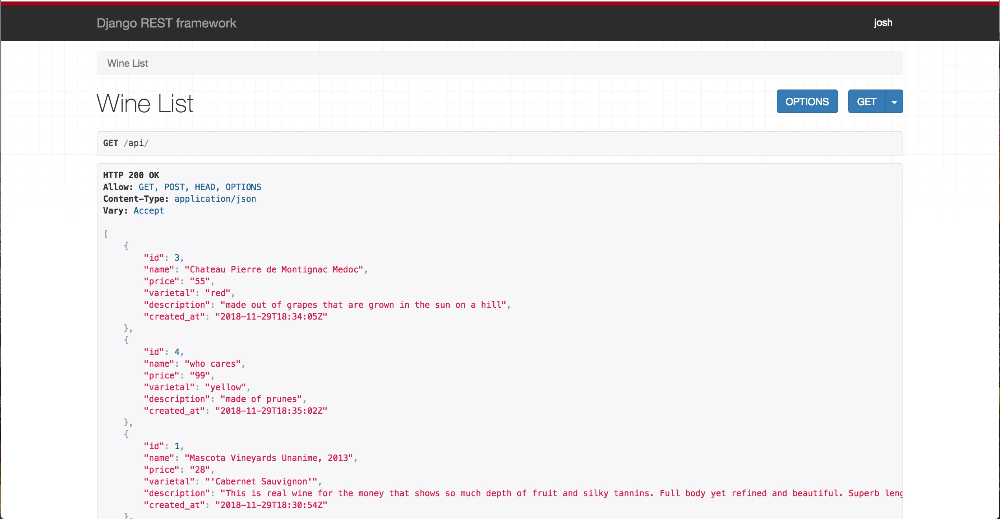

Monday, November 4, 2019
====================
* [Juliet Platoon](https://vimeo.com/324237258)

# Using Django As An API

Today's material is largely based off of [WS Vincent's tutorial](https://wsvincent.com/django-rest-framework-tutorial/). A huge shoutout / thanks to him!

So far we've been using Django to create full stack web applications. This type of app, where both the front and back end are coupled together into a single code base can become a monolithic (i.e., huge) application. In some cases, it works, but as applications grow to hundreds of thousands of lines of code it can become a nightmare to debug and add new features.

Enter the concept of microservices and Service Oriented Architecture (SOA). This idea builds off of Single Responsibility code in that one app does one thing. In this, we create web applications that separate the front and back end. Moving forward, we'll use Django to handle our back end (i.e., getting/receiving data from the database) and React JS to handle all of our front end logic (i.e., what the user sees / interacts with).

## Django REST Framework 

Our Django API will still need to have the same CRUD functionality as our previous full stack Django apps. The only difference is that our views will return JSON instead of HTML. This is such a common pattern that several tools have been created to make developing CRUD apps in Django much easier and much more efficient. One popular tool that we'll be using going forward is called [Django REST Framework](https://www.django-rest-framework.org/)

This framework sits on top of Django and adds some extra functionality that will make our lives much easier. 

## Setting Up Our API 

Let's start by creating a new Django project. Today we're going to create an app that keeps track of different wines.

```bash
$ cd ~/Desktop
$ mkdir wine_project && cd wine_project
$ python -m venv venv
$ source venv/bin/activate
$ pip install django psycopg2
```

If you are having issues with psycopg2, run this command instead:
```bash
$ env LDFLAGS="-I/usr/local/opt/openssl/include -L/usr/local/opt/openssl/lib" pip install psycopg2
```

Continuing on...
```sh
$ django-admin startproject wine_api .
$ ./manage.py startapp wines
```

If you didn't include the `.` after the `startproject` command, you'll have to move the contents of `wine_api` up one level so that your structure looks like this:


Then let's create our Wine model:

```python
# wines/models.py 
from django.db import models
from django.utils import timezone

class Wine(models.Model):
    name = models.CharField(max_length=255)
    price = models.CharField(max_length=10)
    varietal = models.CharField(max_length=255)
    description = models.TextField()
    created_at = models.DateTimeField(default=timezone.now)

    def __str__(self):
        return self.name
```

Connect `wines` to `wine_api` in `settings.py` and change our database adapter to Postgres and name our database effectively in `wine_api/settings.py`:
```python
DATABASES = {
    'default': {
        'ENGINE': 'django.db.backends.postgresql',
        'NAME': 'wine_api',
    }
}
```

Make the migrations with `python manage.py makemigrations` and then run them with `python manage.py migrate` and ensure no errors come up. Finally, create some dummy data to work with. Your choice here - you can either enter data using the Python shell or the admin panel. Add 2-3 wines to test our API with before moving forward.

## Installing Django REST Framework

Now we are ready to install the [Django REST Framework](https://www.django-rest-framework.org/). 

```bash
$ pip install djangorestframework
```

Next we need to add it to our installed apps (`settings.py`):

```python
INSTALLED_APPS = [
    'django.contrib.admin',
    'django.contrib.auth',
    'django.contrib.contenttypes',
    'django.contrib.sessions',
    'django.contrib.messages',
    'django.contrib.staticfiles',

    'wines',
    'rest_framework',
]
```
Django REST Framework offers a ton of functionality out of the box. Feel free to check out the docs to learn more about all the amazing things it has to offer.


### Django REST Framework Setup

We need to do 3 things to get our API working:
1. Set up our routes
2. Create a serializer (more on this later)
3. Import Django REST Framework's built in view functions to handle our JSON responses

#### 1. Routes
First, add the following route to your `wine_api/urls.py` file. 

```python
# wine_api/urls.py
from django.contrib import admin
from django.urls import path, include

urlpatterns = [
    path('admin/', admin.site.urls),
    path('wines/', include('wines.urls')),
]
```

Next, we can set up our wines routes in `wines/urls.py`. 

```python
# wines/urls.py 
from django.urls import path, include
from .views import WineViewSet # This library gives us all of the functions usually found in views.py
from rest_framework.routers import DefaultRouter

router = DefaultRouter()
router.register(r'', WineViewSet, basename='wine')
urlpatterns = router.urls
```

#### 2. Serializers 

Serializing is a fancy way of saying "Convert this data from one format to another." In this case, we want to convert a Django Query object into JSON. That is, we want to make a query to the Postgres database using Django ORM and then translate its output into JSON.

Create a new file `wines/serializers.py` and copy the following code. 

```python
# wines/serializers.py 
from rest_framework import serializers
from .models import Wine

class WineSerializer(serializers.ModelSerializer):
    class Meta:
        model = Wine
        fields = ['name', 'price', 'varietal', 'description']
```

Once again, a lot of the code is being taken care of for us by Django REST Framework. We create our own `WineSerializer` class and let it inherit from the REST framework class (`serializers.ModelSerializer`). From there, we can set up some settings in the `Meta` class. In this case, we tell the serializer which model (i.e., table in the database) to get its data from and which fields we want to convert into JSON (in this case we list the `['name', 'price', 'varietal', 'description']` fields, ignoring our `created_at`. We will leave it to the model to set the created at for us. But if you want the `created_at` date to show up in our RestFramework include it in the `serializers.py` file).

#### 3. Views

The last thing is setting up our views. Again, DRF is going to do most of the heavy lifting. 

```python
# wines/views.py
from .models import Wine
from .serializers import WineSerializer
from rest_framework import viewsets

class WineViewSet(viewsets.ModelViewSet):
    queryset = Wine.objects.all()
    serializer_class = WineSerializer
```

Letting our `WineViewSet` inherit from `viewsets.ModelViewSet` will give us all the CRUD functionality we need in our API. We just have to set the `queryset `and `serializer_class` variables. 


### Let's see this work
**All Wines**

Run your server:
```sh
$ python manage.py runserver
```
Visit `http://localhost:8000/wines/` in your browser. Because we don't have React set up yet, Django rest frame work will provide us with simple front end interface so that we can work with the data. You should see something that looks like the image below. 



If you scroll down to the bottom you'll see a form to create a new wine. Give it a try. 

**An Individual Wine Instance**
To get the data for a specific wine, add the primary key to url. To see just the first wine in the list enter `http://localhost:8000/wines/1/` You'll get the data for just that wine, as well as a form to edit and update it. 


# Deploying to Heroku 
Up until now we've been running all of our Django apps locally. This is great for development, but how do we deploy our apps to a server that is accessible to the rest of the internet? There are many services online designed to make this task easy for us. Amazon Web Services (AWS) is one of the most popular, but it's learning curve is pretty high. The service we will be using today, and for future projects, is called [Heroku](https://www.heroku.com/). It's built on top of AWS, but it abstracts away a lot of the complexity so that deploying apps is super simple. Plus, it will allow us to deploy our app for free!

### Getting Django Ready For Heroku 
We have to add a few things to our Django app to make sure it will run properly when we deploy it. The steps that are going to follow is based off of the [official docs](https://devcenter.heroku.com/articles/django-app-configuration).

1. Create a Procfile
    - The first thing we need to create is a `Procfile` in our app's root directory (at the same level as `manage.py`). In this file, we are going to tell Heroku which web server we want to use for our app. Open the file and copy this line of code `web: gunicorn INSERT_PROJECT_NAME_HERE.wsgi`, being sure to replace "INSERT_PROJECT_NAME_HERE" with whatever the name of your app is. In our case, it's `wine_api`.
    - Gunicorn is the server Heroku recommends we use. Install it with `pip install gunicorn`. 


2. Django-Heroku
    - Most of the rest of the setup is done for us by installing a final `pip` package called `django-heroku`. Run `pip install django-heroku`.
    - Then place `import django_heroku` at the very top of your `settings.py` file and `django_heroku.settings(locals())` at the bottom of `settings.py`. 

3. Requirements 
    - The final thing we need to do is create our `requirements.txt` file in the root (the same level as your `venv` directory. Heroku will use this to download all our dependencies, including `gunicorn` and `django-heroku`. 
      ```bash
      $ pip freeze > requirements.txt
      ```

4. Create your `.gitignore` file
    - You don't need to commit your `venv/` or any pycache's, so let's create a `.gitignore` file and add in `venv/` and `__pycache__/`.

## Creating A New Heroku App 
Go to https://www.heroku.com/ and create a new free account. Once you are logged into your dashboard, click the link to create a new app. Give the app a name and click 'Create App'. Heroku has pretty straight forward instructions on how to proceed. Follow the deployment instructions on the `Deploy` tab.

Once you are done, run your migrations: `heroku run python manage.py migrate` from the root of your project. You can visit your app by pasting the unique URL Heroku provides into your browser, or by clicking 'Open App' in the upper right corner of you Heroku dashboard. You've successfully deployed your first app!

A completed copy of today's code can be found [here in this repo](https://github.com/julietplatoon/django-complete-wine-api).

## Challenges
* First, go over this tutorial yourself
* [Schools API](https://github.com/julietplatoon/school-api)
